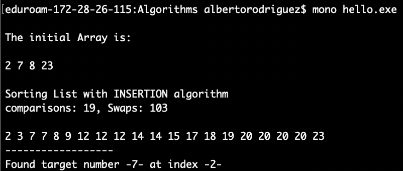

# Algorithm Examples
## Some Algorithms examples (Sort, search...)

*  *binarySearchSorted.cs* - program to find the **target number** using **binary seach** in an array sorted with **insertion** algorithm.
	* Output:  

