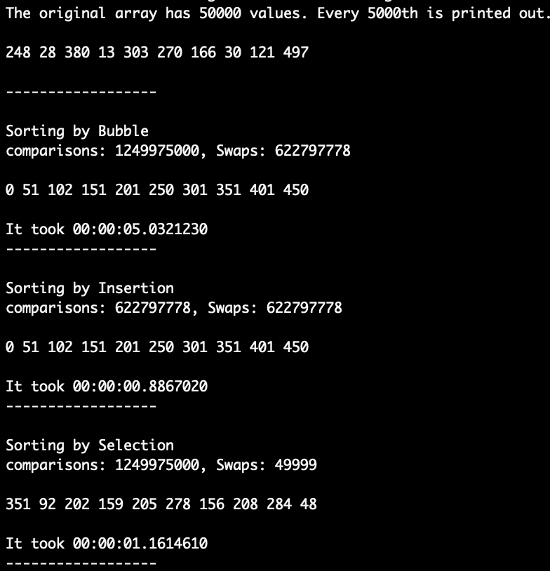
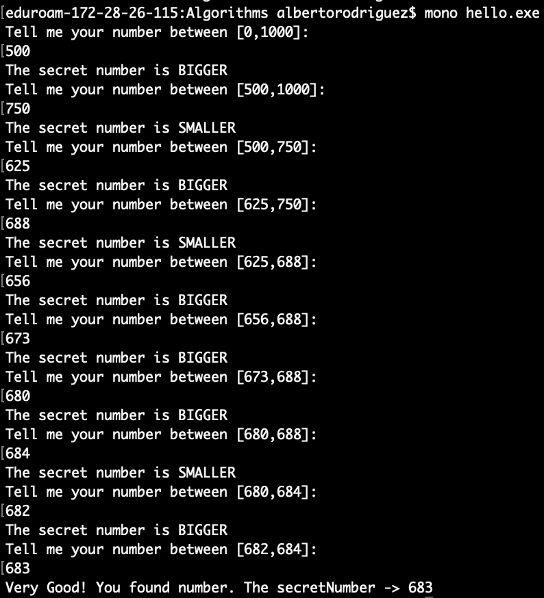
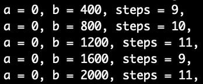

# Algorithm Examples
## Some Algorithms examples (Sort, search...)


*  *binarySearchSorted.cs* - program to find the **target number** using **binary seach** in an array sorted with **insertion** algorithm.
	* Output:  

*  *sortingAlgorithms.cs* - program that contains differents **sorting algorithms**:
	* **Bubble Sort**  
	```C#
      public static int[] BubleSort(int[] tab){
            int n = tab.Length;
            int comparisons = 0;
            int swaps = 0;
            do{
                for(int i=0; i< n-1; i++){
                    int tmp = tab[i];
        
                    if(tmp > tab[i+1]){
                        tab[i]=tab[i+1];
                        tab[i+1]=tmp;
                        swaps++;
                    }
                    comparisons++;
                }
                n= n-1;
            }while(n != 1);
            
            Console.WriteLine("comparisons: {0}, Swaps: {1}", comparisons, swaps);
            return tab;
        }
	```
	* **Selection Sort**  
	```C#
	public static int[] sortBySelection(int[] arr)
        {
            int comparisons = 0;
            long swaps = 0;
            
            int minIndex = 0;
            int min = arr[0];
            
            for (int i = 0; i < arr.Length; i++)
            {
                int tmp = arr[i];
                
                for (int j = i + 1; j < arr.Length; j++){
                    comparisons++;
                    if (arr[j] < min)
                    {
                        min = arr[j];
                        minIndex = j;
                    }
                }
                
                if (i != minIndex)
                {
                   arr[i] = arr[minIndex];
                   arr[minIndex] = tmp;
                   swaps++;      
                }
            }
            Console.WriteLine("comparisons: {0}, Swaps: {1}", comparisons, swaps);
            return arr;
        }
	```
	* **Insertion Sort**  
	```C#

	public static int[] insertionSort(int[] numbers){ 
        int i, key, value;
        int comparisons = 0;
        long swaps = 0;

        for (i=1; i < numbers.Length; i++){
                key = numbers [i]; //the second value of the array
                value = i - 1; //the first value of the array
                
                while (value >= 0 && numbers[value] > key){
                    //insertion of tahe correct number
                    numbers [value + 1] = numbers [value];
                    value = value - 1;
                    swaps++;
                    comparisons++;

                }
                
                numbers [value + 1] = key;
        }
        
        Console.WriteLine("comparisons: {0}, Swaps: {1}", comparisons, swaps);
        return numbers;
    }

	```

	* Output: 

*  *guessTheNumber.cs* - the computer "think" random number between **[min,max]** and you have to guess the number.
	* Output:  

*  *guessTheNumberFunction.cs* - the computer "think" random number with binary search, it looks for the target number and display how many steps to find it for different array's dimension.
    * Output:  


#### How to compile the programs in macOS?

```cmd
mcs -out:hello.exe sortingAlgorithms.cs 
```
	

#### How to run the programs?**

```cmd
mono hello.exe
```


